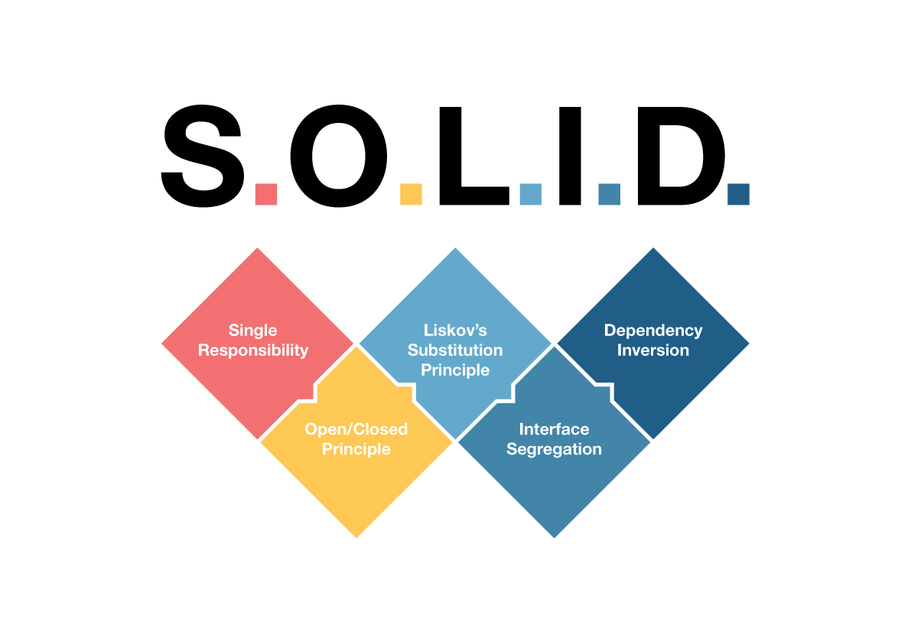

# PRINCIPIOS SOLID Y PATRONES DE DISEÑO

> Los patrones de diseño son una herramienta para diseñar programas que se pueden entender y mantener fácilmente. Los patrones de diseño son el equivalente a los planos de una ciudad mientras que los principios SOLID las leyes que lo mantienen en orden.

¿Por qué es importante usarlos?
- Son soluciones a problemas que a los largo de varias décadas se han desarrollado, entendido y se han propuesto.
- Mejora la mantenibilidad, flexibilidad y la escalabilidad del código.
- Facilita las pruebas tanto unitarias como de integración.
- Mejora el rendimiento del código
- Mejora la experiencia del desarrollador.

## Principios SOLID

### SOLID

- Single Responsibility Principle (SRP)
- Open-Closed Principle (OCP)
- Liskov Substitution Principle (LSP)
- Interface Segregation Principle (ISP)
- Dependency Inversion Principle (DIP)

### S - Single Responsibility Principle (SRP)

> Este principio nos dice que una clase debe tener una y solo una razón para cambiar - Robert C. Martin
- Una clase (o método) debe tener solo una responsabilidad o función.
Beneficios:
- Manteniblidad
- Reusabilidad incrementada
- Facilidad de testeo
- Escalabilidad
- Reducción de la complejidad de las partes que componen el sistema. 
> Hay que aumentar la cohesión y disminuir el acoplamiento

¿Cuando aplicarlo?
- Cuando hay varias razones para cambiar una clase o método.
- Cuando una clase o método tiene demasiadas responsabilidades.
- Alta complejidad y difícil mantenimiento.
- Dificultad para realizar pruebas unitarias.
- Duplicación de código. La responsabilidad no está bien definida.

### 0 - Open-Closed Principle (OCP)
> El principio de apertura y cierre nos dice que una clase debe ser abierta para su extensión, pero cerrada para su modificación -  Robert C. Martin

- Permitir nuevas funcionalidades sin modificar el código existente. Para lograr esto nos apoyamos en: Interfaces, Abstracciones o polimorfirmos.
- Cerrado para su modificación significa que evitamos modificar el código existente, probado y validado. Esto promueve el encapsulamiento y la estabilidad del sistema.

Beneficios:
- Menos errores y actualizaciones más fáciles
- Implementaciones rápidas en cambios de requisitos

¿Cúando aplicarlo?
- Cuando existe necesidad de extender funcionalidades sin modificar el código existente.
- Cambios frecuentes en los requisitoso diseño basado en abstracciones. 
> En el código por ejemplo se puede implementar este principio al agregar una nueva pasarela de pagos o un nuevo tipo de notificación com mensajes de texto.

### L - Liskov Substitution Principle (LSP)
> Este principio nos dice que una subclase debe ser substituible por su clase base - Barbara Liskov
Importancia:
- Evita comportamientos inesperados al usar subclases
- La razón funfamental de este principio es asegurar la coherencia y correcta ejecución del programa

Características:
- Las subclases deben respetar el contrado de la clase base. No se deben modificar la firma de los métodos ni incrementar atributos.
- Mantener la compatibilidad de interfaces y tipos
- No introduce excepciones inesperadas
Beneficios:
- Reutilización de código
- Mantener la compatibilidad de interfaces y tipos
- Reducción de errores en tiempo de ejecución ya que se mantiene la consistencia y coherencia a lo largo del sistema

¿Cuando aplicarlo?
- Cuando existen violaciones de precondiciones o post-condiciones. Cuando necesito agregar parámetros en los métodos o cuando el tipo de dato de retorno de los métodos se cambia.
- Cuando existen excepciones inesperadas en subclases


## Instalación de dependencias con uv
```
# Instalación de uv
curl -LsSf https://astral.sh/uv/install.sh | sh

# Creación del ambiente virtual
uv venv

# Activación del ambiente virtual
source .venv/bin/activate

# Instalación de dependencias
uv pip install -r pyproject.toml --extra dev
```